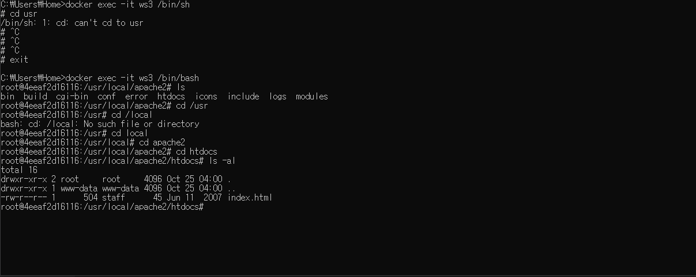

docker exec ws3 pwd

ws3 컨테이너에서 명령어를 실행

docker exec ws3 /bin/sh

쉘이라는 프로그램은 사용자가 입력한 명령어를 쉘이 받아서 운영체제에거 넘겨주는 역할을 함.

docker exec -it ws3 /bin/sh
 지금부터 내리는 명령은 ws3에서 실행해주는 것.

- -i와 -t는 운영체제에 대한 이해가 필요함.

---

기본적으로 들어있는 index.html의 경로

위 경로까지 들어가서 vim index.html을 입력하면 에러가 뜨게 됨.
  => 컨테이너의 덕목은 용량이 작은 것이기 때문! 

apt update라는 명령어를 입력하고

apt install nano(vim)을 입력하면 nano를 설치할 수 있으며

nano index.html로 파일에 접근 할 수 있게됨.